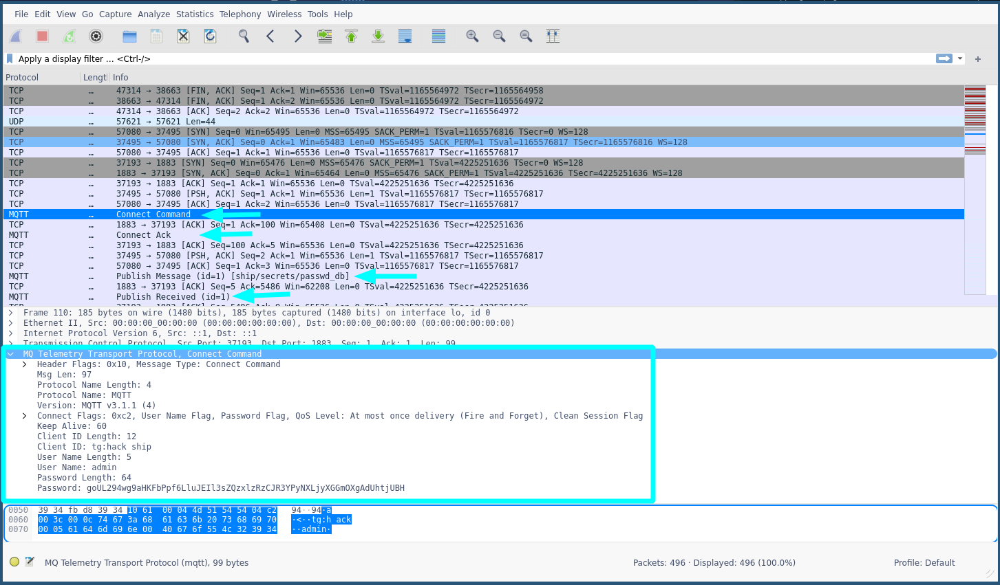

# Internet_Of_Things_Ship
> Author: Skandix#1269


## PatchNotes
* 1.0 - UN-F****** SOLVABLE (as part of the hash for pwdb was missing from script)
* 1.2 - Re-capture traffic (with the rest of the hash for pwdb :) )

## Chall
### Description
```
Yarr, some of our pirate lads installed something called the Internet of THANGS,
I don't know this language of the interniet.
But they gave me this pirate capture file called ``ship_of_things.pcap``
Can you look at this for me, my lad says it's seacure but can you take a look ?
```

### Solution
1. Open up the ``ship_of_things.pcap`` with wireshark or your favorite tool to process data traffic dumps.

If you have not worked with MQTT traffic from before, I can say that by only having a username and password to "ensure" "private" communication between publisher and broker and vice-versa with subscriber is a bad way. As here you are free to capture the traffic un-encrypted and with the username and password in clear text.

Mkay, here's a good site to lookup mqtt specific stuff regarding its protocoll [mqtt docs](http://docs.oasis-open.org/mqtt/mqtt/v3.1.1/os/mqtt-v3.1.1-os.html#_Toc398718033)



So when looking on the traffic dump in wireshark you can see there is a lot going on, but i've made arrow pointing on the important stuff m'kay.
So first off we can see ``Connect command`` which connects to the Mosquitto broker, and rigth under we can see that the credentials are correct as mosquitto give us an **ACK** back which gives us the green ligth to start publishing data. 
The first message it start publishing is on the topic ``ship/secrets/passwd_db`` This is very intressting as who the `f***` in his good mind would publish his password db  over mqtt... enough of that.


If we rigth click on the Packet > Follow > TCP Stream (As seen on the screenshot)


Then we will see this window, from the data it sent.


Start of the data is ``A9mimm`` and the end of the data is ``F9llk``


We will copy the data into a file and call it ``ship_pwdb.kdbx.base64``
do some bash magic to convert it from base64 into something we can open with keepass

```bash
cat ship_pwdb.kdbx.base64 | base64 -d >> ship_pwdb.kdbx
keepass ship_pwdb.kdbx
```

Since we already have the admin username and password, this migth be used to open the keepass db, which it does :D
and inside there we will find the flag.

FLAG: ``TG21{th3_S_1n_107_5t4nd5_f0r_Sh1p}``
