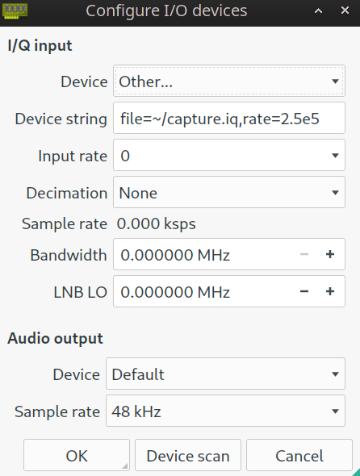
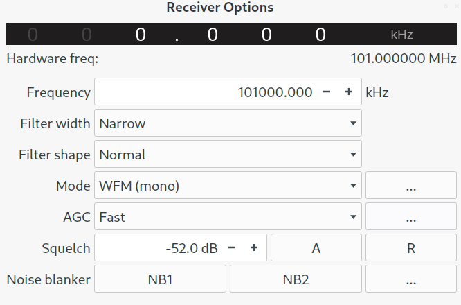

# UVB-101

> It seems like the Russians upgraded their Kool radio station to a Mega cool radio station. We captured this transmission at 2.5e5 samples per second, can you figure out what they were transmitting?

## Solution
The challenge hints towards Russian radio station, and the challenge name is "UVB-101". If we Google "UVB-101 radio station" we can find a shortwave radio station, with the nickname of "The Buzzer", [UVB-76](https://en.wikipedia.org/wiki/UVB-76).

The original station (UVB-76) broadcasts on the frequencies 4625 and 4810 kHz, the challenge description hints that the Russians upgraded from a "Kool" (kHz) to a "Mega cool" (MHz) radio station. The challenge name (UVB-101) also hints towards the frequency of 101 MHz.

Downloading and checking the file, we see that the file contains raw data, which is to no help.

```
$ file capture.iq
capture.iq: data
```

Googling after `iq file format` returns results related to I/Q waveform files. There are multiple tools that can be used to read raw I/Q captures, this writeup uses [Gqrx](https://gqrx.dk/).

### Gqrx
We can load the capture file into gqrx, with the following settings, and we know the sample rate from the task description:

`file=~/capture.iq,rate=2.5e5`



Then we need to tune into the correct frequency 101 MHz (the capture width of this challenge was small, so one does not need to tune in to the correct frequency). However, we do need to find the correct mode.



Gqrx comes with multiple modes, and after scrolling through the modes we hear relatively clear audio when using WFM (Wideband FM).

The capture starts with 6 loud buzzers, followed by a Russian voice reading some numbers. The start of the capture and the entire recording can be found below **(NB! Loud)**.


We notice that there is a 2 second pause between each number reading. Writing down the numbers give us the following:

`84 71 50 49 123 75 71 66 95 73 78 95 83 80 65 67 69 125`

By using the ASCII character codes (decimal), we translate the string, which finally gives us our flag.

`T G 2 1 { K G B _ I N _ S P A C E }`

**FLAG:** `TG21{KGB_IN_SPACE}`
