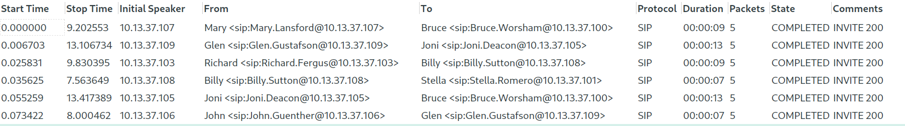

# Space Calls

> A hacker has extracted some data from our systems using VoIP calls. We managed to capture a dump of all the calls during that time, but the calls are all scrambled, and in the wrong order. Can you help out finding the data they extracted?

**Hints:**

> 1. RFC 3261, RFC 3665, RFC 4040 - 5., RFC 4566 - 6., RFC 3551 - 4.5.14 and 6., and RFC 3550

## Analysis

We are provided with a network capture file, `dump.pcap`, we start by opening the provided file in Wireshark, and are provided with 38857 network packets. 


By looking at the `Statistics -> Protocol Hierarchy`, we see that the protocols used are the Session Initiation Protocol (SIP) and Real-Time Transport Protocol (RTP). 


With that information, and the fact that the challenge description mentioned VoIP calls, we continue our analysis by looking at the VoIP calls that were captured. `Telephony -> VoIP Calls` gives us a list of VoIP 1022 calls.



We can now look at the `Flow Sequence` for these calls, and see that they resemble a normal flow for a VoIP call, we continuing by playing the streams (with `Play Steams`) of these calls. There is a male voice speaking out a single letter from the NATO Phonetic Alphabet per call. An example (`Papa`) can be found [here](assets/P.mp3). Notice also that the call uses `g711A` as the audio codec. 


By clicking on `Prepare Filter`, we can see the packets for a specific call, parameters we the media attribute `PCMA/8000`.


## Solution #1

There is a "simple" method that can be used to solve this challenge, which requires no knowledge of the protocol, but it is a bit more tedious.

By looking through the VoIP calls you can either find that there is a `User-Agent` called `TGHack SpacePhone 1337`, or that there are `Call-ID`s that only include numbers (`1337`, `1338`, `1339`, etc.).

This can also be found by doing a simple `strings` and grepping for `tg`, as seen below.

```shell
$ strings dump.pcap | grep -i TG
--- snip ---
User-Agent: TGHack SpacePhone 1337
Call-ID: 1c96c72e-88a5-11eb-9298-9cb6d0e26313@sip.tghack.no
Call-ID: 1bdae4fa-88a5-11eb-9298-9cb6d0e26313@sip.tghack.no
Call-ID: 1d23f27a-88a5-11eb-9298-9cb6d0e26313@sip.tghack.no
User-Agent: TGHack SpacePhone 1337
--- snip ---
```

Once you either find the `User-Agent`, or the `Call-ID`, you can add a filter to find the calls that use these values, and solve this challenge manually by listening to the calls with `Play Streams`. The following filter returns 22 calls, and we see that the `Call-ID` for each packet increase sequentially `1337, 1338, 1339, etc.` instead of containing a proper `Call-ID`, indicating that these calls are related to the flag.

**Wireshark filter:** `sip.User-Agent == "TGHack SpacePhone 1337" and sip.Request-Line contains "INVITE"`


## Solution #2

This is the intended solution of this challenge, and requires coding knowledge and also requires _some_ knowledge of the theory behind VoIP calls (SIP, SDP, and RTP).

### Session Initiation Protocol (SIP)

>  SIP is an application-layer control protocol that can establish,
>   modify, and terminate multimedia sessions (conferences) such as
>   Internet telephony calls.
>
> --- snip ---
>
>   SIP supports five facets of establishing and terminating multimedia communications:
>
>  --- snip ---
>
> User capabilities: determination of the media and media parameters to be used;
- [RFC 3261](https://tools.ietf.org/html/rfc3261)

In other words, it's one of the protocols that are used to to make VoIP calls function. The calls in this challenge are extremely simplified, more advanced call flow examples can be found in [RFC 3665](https://tools.ietf.org/html/rfc3665).

### Call flow

We take the first call between Mary and Bruce as an example to explain a basic high-level call flow.
- **F1**: Mary invites Bruce to a VoIP call, and sends information regarding which media parameters/attributes she supports through Session Description Protocol (SDP).
- **F2**: Bruce responds with his media capabilities 
- **F3**: Mary acknowledges (ACK) and RTP streams are established between Mary and Bruce, with the media capabilities that they negotiated. However it is only one-way (from Bruce to Mary).
- **F4**: Bruce ends the call.
- **F5**: Mary acknowledges that Bruce ended the call. 

```
   Mary                     Bruce
     |                        |
     |       INVITE F1        |
     |----------------------->|
     |                        |
     |       200 OK F2        |
     |<-----------------------|
     |         ACK F3         |
     |----------------------->|
     |    One Way RTP Media   |
     |<-----------------------|
     |                        |
     |         BYE F4         |
     |<-----------------------|
     |       200 OK F5        |
     |----------------------->|
     |                        |
```

Additional examples of the `Flow Sequence` we saw can be found in [RFC 3665](https://tools.ietf.org/html/rfc3665).

### Message Header

Let's take a closer look at the message headers of SIP. We mainly need to focus on the `User-Agent` [RFC 3261 - 20.41](https://tools.ietf.org/html/rfc3261#section-20.41) and `Call-ID` [RFC 3261 - 20.8](https://tools.ietf.org/html/rfc3261#section-20.8) headers. We notice that there is multiple different user agents, and the call IDs seem unique. We currently have no indication to which calls are related to our flag, and will investigate this further on below.

### Media Attributes

We see that the `SIP/SDP` packets that negioate the media capabilities include the following information, `recvonly` here specifies that the sender (Mary) is only able to receieve media, and not send any. Thus we have a one way media stream. 

```
Media Description, name and address (m): audio 54170 RTP/AVP 8
Media Attribute (a): rtpmap:8 PCMA/8000
Media Attribute (a): recvonly
```

By looking at RFC 4566 [5.14.  Media Descriptions ("m=")](https://tools.ietf.org/html/rfc4566#section-5.14) and [6. SDP Attributes](https://tools.ietf.org/html/rfc4566#section-6), we find that the format for these parameters are the following:
```
m=<media> <port> <proto> <fmt> ...
a=rtpmap:<payload type> <encoding name>/<clock rate> [/<encoding parameters>]
```

For this call we see that audio is transmitted with RTP/AVP over port 54170, with `fmt` (format) `8`. Furthermore, the `rtpmap` specifies the payload type as `8`, with `PCMA` as the encoding at a clock rate of `8000`.

Looking closer at [RFC 3551 - 6.  Payload Type Definitions](https://tools.ietf.org/html/rfc3551#section-6), we find that this simply means that for this call the payload type `8` indicates that `PCMA` encoding is used at a sampling rate of `8,000 Hz` with `1 channel`.

```
For example, a session directory could specify that for a
given session, payload type 96 indicates PCMU encoding, 8,000 Hz
sampling rate, 2 channels

PT    encoding    media type  clock rate   channels
      name                    (Hz)
___________________________________________________
 8    PCMA        A            8,000       1
```

### Real-time Transport Protocol (RTP)

We see from the call flow that the call uses Real-time Transport Protocol (RTP).

>  This memorandum describes RTP, the real-time transport protocol.  RTP
>   provides end-to-end network transport functions suitable for
>   applications transmitting real-time data, such as audio, video or
>   simulation data, over multicast or unicast network services.
- [RFC 3550](https://tools.ietf.org/html/rfc3550)

Knowing that the audio is transmitted over RTP, we find [RFC 4040 -  Mapping to Session Description Protocol (SDP) Parameters](https://tools.ietf.org/html/rfc4040#section-5), which mentiones how the RTP parameters are mapped to SDP. 

> Parameters are mapped to SDP in a standard way.
>      o  The MIME type (audio) goes in SDP "m=" as the media name.
>      o  The MIME subtype (clearmode) goes in SDP "a=rtpmap" as the
>          encoding name.

We see from our RTP packets that the payload type is again `ITU-T G.711 PCMA (8)`, and per [RFC 3551 - 4.5.14 PCMA and PCMU](https://tools.ietf.org/html/rfc3551#section-4.5.14) we find details about how the audio data is encoded.

> PCMA and PCMU are specified in ITU-T Recommendation G.711.  Audio
> data is encoded as eight bits per sample, after logarithmic scaling.
> PCMU denotes mu-law scaling, PCMA A-law scaling.  A detailed
> description is given by Jayant and Noll.  Each G.711 octet SHALL
> be octet-aligned in an RTP packet.  The sign bit of each G.711 octet
> SHALL correspond to the most significant bit of the octet in the RTP
> packet (i.e., assuming the G.711 samples are handled as octets on the
> host machine, the sign bit SHALL be the most significant bit of the
> octet as defined by the host machine format).  The 56 kb/s and 48
> kb/s modes of G.711 are not applicable to RTP, since PCMA and PCMU
> MUST always be transmitted as 8-bit samples.

### Audio codec

VoIP calls can include multiple audio and video codecs, in this challenge, only one audio codec is used. 

Our intial analysis of the VoIP calls have mentiones of `g711A` and `PCMA`. After some quick Googling we find [RFC 7655](https://tools.ietf.org/html/rfc7655) which describes `g711A` as

>    Both A-law and mu-law supported: G.711 has two operating laws, A-law and mu-law.  These two laws are also known as PCMA and PCMU in RTP applications [RFC3551].

Which again comes back to what we found `PCMA/8000` (`Pulse Code Modulation A-law`)  when looking at the packets. `g711A` is somewhat outdated, but is still used today. A superior alternative is the [Opus Codec](https://opus-codec.org/), which is used by Discord, WhatsApp, Zoom, PlayStation 4, and other. A comparison between audio codecs can be seen below.


More information: https://opus-codec.org/comparison/


### Scapy

As mentioned previously, this is possible to solve without writing any code as seen in solution #1. However, without that luck, we have to solve this programmatically. The second hint mentiones a tool for packet manipulation, and with that we find [Scapy](https://scapy.net/), [dpkt](https://dpkt.readthedocs.io/) is another alternative.

> Scapy is a powerful interactive packet manipulation program. It is able to forge or decode packets of a wide number of protocols, send them on the wire, capture them, match requests and replies, and much more.

Unfortanely, Scapy has no layer definition for SIP, and thus requiring some knowledge of the protocol, which makes this challenge even harder.

We attempt to find the differences between the calls, and start with the SIP header `User-Agent`.

#### `User-Agent`
We write a quick script that loops through all the packets and find the SIP packets and prints out the `User-Agent` for each call, and notice the user agent named `TGHack SpacePhone 1337`. This script can be found here: [`find_user_agents.py`](assets/find_user_agents.py)

```shell
$ python find_user_agents.py
--- snip ---
OmniSession/1.0.0.3
TGHack SpacePhone 1337
X-Lite build 1061
--- snip ---
```

#### `Call-ID`
We use the script made previously and continue by extracting the `Call-ID` of these calls, which show that the call ID's follow a sequential pattern `Call-ID: 1337`, `Call-ID: 1338`, etc. Whilst the other calls use a proper `Call-ID` like `Call-ID: 159aec16-88a5-11eb-9298-9cb6d0e26313@sip.tghack.no`. This is another indicator that we are on the correct path to finding the flag.

```python
call_id = int(re.search(r"Call-ID: (.*)\r\n", payload).group(1))
```

#### Flag Calls
We have now found a suspicious `User-Agent` and `Call-ID`s, with that we find that there are 22 calls that use this user agent, indicating that these call are what we are looking for.

By looking back at [RFC 4566 - 5.14.  Media Descriptions ("m=")](https://tools.ietf.org/html/rfc4566#section-5.14), we start to map out the calls to their ports, for example for the information below, we see that the call uses port `54170` over `RTP/AVP`. For now we skip the `RTP` packets.

```
Media Description, name and address (m): audio 54170 RTP/AVP 8
--- snip ---
m=<media> <port> <proto> <fmt> ...
```

```python
rtp_port_call_mapping = {}
for packet_number, packet in enumerate(packets):
	// --- snip ---
        rtp_dst_port = int(
            re.search(
                r"m=audio (.*) RTP/AVP {payload_type}\r\n".format(
                    payload_type=PAYLOAD_TYPE
                ),
                payload,
            ).group(1)
        )
        rtp_port_call_mapping[rtp_dst_port] = call_id

```

#### Flag RTP packets

With a mapping of the ports used for each of these calls, we can finally extract the raw audio from these calls. Using the information we found from the RFCs related to RTP we start looping through all of the packets in the capture and look for the packets that use one of the ports we mapped above. Noting that the `Call-ID`s are sequentials, we sort the flag calls by them. We now have a variable `flag` containing the raw audio bytes of all the calls.

```python
flag_calls = collections.defaultdict(bytes)
for packet_number, packet in enumerate(packets):
    udp = packet[UDP]
    if udp.dport not in rtp_port_call_mapping:
        continue
    call_id = rtp_port_call_mapping[udp.dport]
    """
    We have a RTP packet and its Call-ID,
    extract the raw audio and append the data
    for that flag to the call
    """
    raw = udp.payload.load[11:].replace(b" ", b"")
    flag_calls[call_id] += raw

# Let's sort the Call-ID-s as we see they start with 1337 and are sequential
flag_calls = collections.OrderedDict(sorted(flag_calls.items()))

# Loop through the flag calls and append the raw audio to a variable
flag = b""
for call_id, flag_call in flag_calls.items():
    flag += flag_call
```

Following all the information we found about `PCMA` above, we convert the raw audio into a MP3 file (`flag.mp3`) by using [`pydub`](https://github.com/jiaaro/pydub), which uses `ffmpeg`. It is also possible to do this with for example `sox`.

```python
# Load the a-law audio into memory instead of saving into a file, and finally convert export it to mp3
f = io.BytesIO(flag)

# Equivalent of doing: ffmpeg -f alaw -ar 8000 -i flag.alaw flag.mp3
sound = AudioSegment.from_file(f, "alaw")
sound = sound._spawn(sound.raw_data, overrides={"frame_rate": 8000})
sound.export("flag.mp3", format="mp3")
```

The entire script can be found [here](assets/solve.py).

Listening to [`flag.mp3`](assets/flag.mp3) we hear the same male voice reading the following:

```shell
TANGO
GOLF
TWO
ONE
CURLY BRACKET START 
SIERRA
ONE
PAPA
UNDERSCORE
CHARLIE
ZERO
MIKE
MIKE
UNIFORM
NOVEMBER
ONE
CHARLIE
FOUR
TANGO
ZERO
ROMEO
CURLY BRACKET END
```

Translating this into "English", we get the following, and finally the flag.
```shell
T
G
2
1
{
S
1
P
_
C
0
M
M
U
N
1
C
4
T
0
R
}
```

**FLAG:** `TG21{S1P_C0MMUN1C4T0R}`
