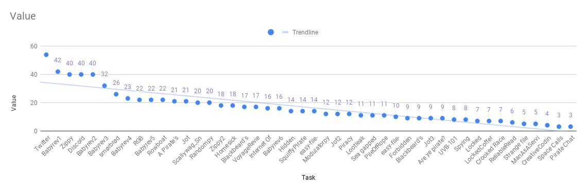

# TG:HACK 2021
> Here are all graphs from public and admin dashboards!

* **186** users registered
* **108** teams registered
* **23495** total possible points
* **46** challenges
* **Twitter** has the most solves with 54 solves
* **Space Calls** has the least solves with 3 solves

## Top 10 Teams

## Top 10 Users
| Place | User       | Score |
| ----- | ---------- | ----- |
| 1     | poiko      | 22533 |
| 2     | unblvr     | 17829 |
| 3     | tryeng     | 15917 |
| 4     | coldboots  | 15029 |
| 5     | kek🍔      | 10086 |
| 6     | vcpo       | 10051 |
| 7     | BobuSumisu | 9954  |
| 8     | jalgroy    | 7142  |
| 9     | sebbert    | 6629  |
| 10    | shirajuki  | 6170  |

## Solve Counts

## Score Distribution

## Solve Percentages per Challenge

## Submission Percentages

* **767** right submissions
* **612** wrong submissions

## Category Breakdown

